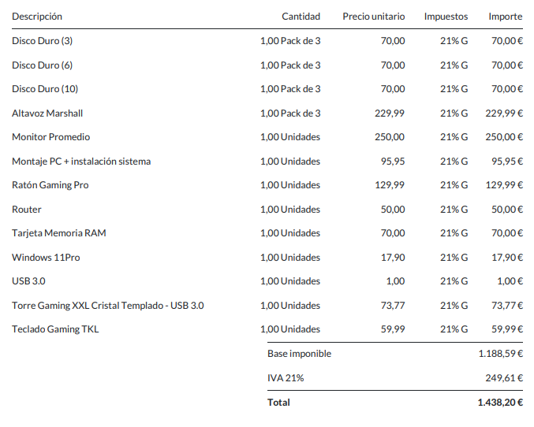
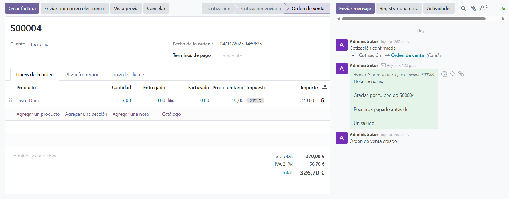
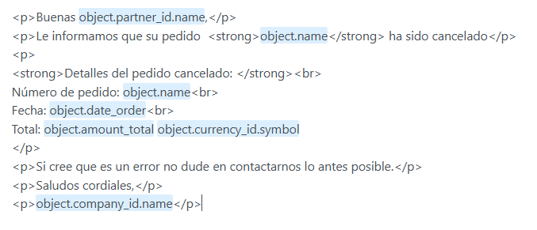

# Instalación de Ubuntu Server y Odoo.
Voy a empezar instalando Ubuntu Server:
1. Descargar ISO.
2. Instalar la ISO en Virtual Box.
3. He usado una nueva función para instalar la ISO en Virtual Box, que poniendo el nombre del host, usuario (vboxuser), contraseña (changeme), rellenando los GB de RAM (4), la capacidad del disco (25 dinamica) y un núcleo de CPU, te genera la instalación automaticamente.
4. Ahora arrancamos la maquina virtual.
5. Una vez arrancada llega el primer problema, los locales no están en español, para eso usaremos el comando 'dpkg-reconfigure locales' e instalamos “es_ES. UTF-8”.
6. A continuación para cambiar la distribución del teclado a español, usamos el comando "dpkg-reconfigure keyboard-configuration", escojo el teclado "Generic 105-key pc" una vez escogido ponemos que la distribucion es "Spanish" y omitimos los atajos de teclado.

## Instalacion de Odoo en Docker.
Para poner en marcha el repositorio, lo primero que haremos será actualizar nuestro índice de
paquetes y tras ello, instalar los paquetes necesarios para que se puedan utilizar repositorios con HTTPS, para ello empezaremos usando:

`sudo apt-get update`
`sudo apt-get install ca-certificates curl`

Ahora que ya hemos finalizado este paso, pasaremos al siguiente el cual es descargar la clave GPG
del repositorio de Docker CE, porque desde el repositorio oficial de ubuntu no es recomendable, para ello hay q ejecutar lo siguiente:

`sudo install -m 0755 -d /etc/apt/keyrings`
`sudo curl -fsSL https://download.docker.com/linux/ubuntu/gpg -o
/etc/apt/keyrings/docker.asc`
`sudo chmod a+r /etc/apt/keyrings/docker.asc`

Ahora usaremos el siguiente comando para ver la distribución que tenemos:
`lsb_release -cb`
Esto devuelve "noble" por lo que significa que estamos en "Ubuntu Noble 24.04 (LTS)".

Como estoy teniendo el problema de copiar los comanso a mano, instalo un "ssh server" con:
`apt install openssh-server`
Para poder conectar la maquina virtual con mi maquina física.

Al conectar la maquina virtual con la maquina física con:
`ssh vboxuser@172.20.10.3` desde la maquina física, me da error ya que tengo conectada la maquina virtual a internet por NAT.
Para solucionarlo voy crear una regla en el reenvio de puertos.
Despues de realizar esto, me conecto a la maquina virtual desde el CMD usando el siguiente comando:
`ssh usuario@localhost -p 2222` indicando el puerto que he establecido en la regla de reenvio de puertos.

Ahora con NAT me da problemas para hacer los pasos de instalacion en este caso este:
`echo \ 
  "deb [arch=$(dpkg --print-architecture) signed-by=/etc/apt/keyrings/docker.asc] 
https://download.docker.com/linux/ubuntu \ 
  $(. /etc/os-release && echo "$VERSION_CODENAME") stable" | \ 
  sudo tee /etc/apt/sources.list.d/docker.list > /dev/null 
sudo apt-get update `
Para evitar los problemas he decidido volver a intentar usar adaptador puente pero esta vez usando mis datos móviles y ha funcionado, es decir, el problema era del wifi del colegio ya que con el wifi del colegio no me generaba una IP.

Una vez este instalado docker y Odoo procedo a iniciar los contenedores de "odoo-db" y "odoo-web" para poder acceder a Odoo desde el navegador usando el puerto "8069" y usando la ip de la máquina en este caso "172.20.10.3".

Una vez accedido desde el navegador a Odoo nos pedira una serie de datos, en correo electónico ibamos a usar "Ethereal email" pero debido a un mal uso de usuario lo han capado por lo que el profesor nos va a proporcionar una cuenta de gmail.

Al acceder a Odoo desde el navegador nos pide que introduzcamos los cmapos siguientes:
- Nombre de la Base de datos.
- Correo electrónico. (apptorrent@theinkgarage.com)
- Contraseña. (ara180604)
- Número de télefono.
- Ubicación.

Ahora que hemos rellenado los datos y hemos accedido a Odoo, procedemos a instalar el apartado de ventas, inventario, stock disallow negative.

Una vez instaladas las aplicaciones, accedemos a ajustes, usuarios y empresas y creamos los siguientes usuarios y empleados:

## Responsables:

### En ventas:
- Julia García López: 
    - Correo: juliagarcialopez@gmail.com

### Compras:
- Juan Torres Ruiz:
    - Correo: juantorresruiz@gmail.com

### Almacén:
- Tatiana Martínez Sanz:
    - Correo: tatianamartinezsanz@gmail.com

### Administración:
- Vicent Giménez Vidal:
    - Correo: vicentgimenezvidal@gmail.com

### Gerente:
- Manuel García Belmonte:
    - Correo: manuel@theinkgarage.com

## Comprobación del correo
Ahora procedemos a hacer la comprobación de que nuestro correo funciona en está página:
- https://webmail.theinkgarage.com/cpsess2590805471/3rdparty/roundcube/?_task=mail&_mbox=INBOX

Básicamente para ver los correos que llegan, etc.
Para ello usamos las siguientes credneciales:
- Correo: apptorrent@theinkgarage.com
- Clave: PerenxisaAPP.

Una vez ya comprobado el correo y agregado las aplicaciones necesarias a Odoo, habrá que comenzar a tratar con proveedores, generar pedidos, generar productos, etc.

## Proveedores
Para dar de alta a un proveedor accederemos a "Pedidos -> Proveedores -> Nuevo" y aqui introducimos el nombre de la empresa, en este caso "PatoComponentes" y su correo "psvsolis@gmaill.com" y le damos a guardar.

El proveedor nos envia un pedido con los articulos a añadir en nuestro Odoo.

## Compartir los volúmenes
Ahora para que el profesor se pueda descargar nuestro Odoo con la configuración, clonamos el repositorio en una carpeta en la maquina virtual usando:
`git clone https://github.com/alarmi04/2DAW.git`
Una vez creado procedemos con los siguienes pasos:
1. Entrar en la rama con: `git switch sistemas_gestion_empresarial`
2. Mover los volumenes a la carpeta del repositorio.
3. Hacer un `git add *` con los volumenes y realizar un commit y un push.
4. Tambien necesita un backup.tar que hemos creado con `tar -cvf nombre_archivo.tar carpeta_o_archivo`, pero a la hora de commitear este fichero da un error de espacio, es mayor de 100 Mb.

Para solucionar ese problema em instalo en el CMD rclone, y lo configuro con los siguientes pasos:

Para instalar rclone: `sudo apt update sudo apt install rclone -y`
Para entrar en la configuracion: `rclone config`, una vez entrado seguiremos los pasos siguientes:
1. Escribe n para crear una nueva configuración.
2. Ponle un nombre (por ejemplo, gdrive).
3. Selecciona el número correspondiente a Google Drive.
4. Cuando te pida el client_id y client_secret, puedes dejarlos vacíos (usa los predeterminados).
5. En scope, elige 1 (acceso completo).
6. Cuando pregunte si quieres configuración avanzada, di no.
7. Cuando pregunte si quieres usar auto-config, si estás en un servidor sin interfaz gráfica, di no.
    - Te mostrará una URL.
    - Copia esa URL, pégala en tu navegador local, autoriza tu cuenta de Google, y pega el código que te da en el servidor.
8. Confirma y guarda la configuración.

Y subo el archivo usando este comando:
`rclone copy -P /home/vboxuser/2DAW/2DAW/SGE/backup.tar gdrive:/Backups`

## Productos

Ahora despues de iniciar los contenedores en Odoo, procedemos a acceder a la seccion de Inventario/Productos y creamos los productos, los cuales hemos recibido a traves del correo como un pedido:



## Nuevo correo asociado

Para asignar a Odoo otro correo lo que vamos a hacer es lo siguiente:
1. Conectarnos a la máquina por ssh, `ssh vboxuser@ip`.
2. Activar los contenedores estando en el directorio del "docker-compose.yml" con `docker compose up -d` -d para dejarlo en segundo plano y poder usar la terminal.
3. Accedo a Odoo desde el navegador poniendo la IP:8069
4. Una vez en Odoo.
5. Accedemos a ajustes y cambiamos el correo de la empresa y del usuario administrador a "apptorrent@odooserra.work.gd"
6. Creamos un correo saliente y uno entrante.


## Asignar prefijos.

Para asignar los prefijos a los presupuesto, facturas... Accederemos al modo desarrollador que esta al final del todo en ajustes.
1. Una vez activado, arriba en el menú nos saldrá el apartado de técnico.
2. Accedemos a Técnico.
3. Y vamos al apartado de secuencias.
4. Buscamos las necesarias en este caso Purchase.order porque las facturas no dejaba.
5. Cambiamos el prefijo por "PED-%(y)s-".

# SEGUNDO TRIMESTRE.

## Plantillas de correo.

Para crear una plantilla de correo realizaremos los siguientes pasos:
1. Se pone en modo desarrollador 
2. Accedemos a plantillas de correo
3. Creamos una nueva
    - aplica a : Orden ventas
    - asunto : pedido de venta
4. Para personalizar el asunto hay que hacerlo en contenido, y que ponerlo igual pero con dos **{}**, es decir, **{{ object.name }}**, además ponemos **"[CUSTOM]"** delante del asunto para distinguir con más facilidad la plantilla.
5. Contenido: 
    - En el mensaje / y entrar en el antepenultimo **#** (Marcador de posición dinamico) **cliente** (cliente parner id, nombre) = object.partnner_id.name. 
    - Recuerda pagarlo antes de: object.payment_term_id.name (para esto hay que ponerle condicion de pago al pedido ) gracias por tu pedido object.name. 

## Automatización de los correos.

Para poder automatizar que se envie por ejemplo un correo de confirmación al crear un pedido hay q hacer lo siguiente:
1. Activar el modo desarrollador.
2. Acceder a técnico -> acciones -> acciones del servidor -> nuevo
3. Le ponemos un nombre a la acción en este caso **"[CUSTOM] Enviar correo electrónico automáticamente en venta"**
4. Escogemos el tipo en este caso **"Enviar correo electrónico"**
5. En modelo ponemos **"Orden de venta"**
6. Esocgemos la plantilla de correo electrónico anteriormente creada **"[CUSTOM] Confirmación pedido de venta automático"**
7. Enviar correo electrónico como **"Mensaje"** para que asi se muestre en el historial de la derecha.

Cuando ya hemos configurado lo anterior para poder crear la automatización vamos a **Aplicaciones** y activamos **Reglas de automatización**.

Una vez instalado el módulo hacemos lo siguiente:
1. **Accedemos a técnico** -> Automatización -> Reglas de automatización -> Nuevo
2. **Nombre** "[CUSTOM] Envío mail venta automática"
3. **Modelo:** "Orden de venta"
4. **Activar:** El estado establecido como -> **Orden de venta**
5. **Agregar acción:** 
    - Tipo: Ejectutar acciones existentes.
    - Detalles de la acción: Agregar -> **"[CUSTOM] Confirmación pedido de venta automático"**

Para comprobar que funciona correctamente vamos a crear un pedido de venta, accediendo a **Venta** -> **Nuevo**.

Y debería de aparecer lo siguiente:




### Configuración de otra plantilla de correo.

El primer paso será activar el modo desarrollador, a continuación en el menú superior accederemos a **"Técnico"** -> **"Correo electrónico"** -> **"Plantillsa de correo electrónico"**.

Una vez aquí, procederemos a la creación de una plantilla de correo para cuando se cancele un pedido, para ello seguiremos los siguientes pasos.

1. Clicaremos en **Nuevo**.
2. **Nombre:** "[CUSTOM] Cancelación de pedido"
3. **Aplica a:** "Orden de venta"
4. **Asunto:**  `Su pedido {{ object.name }} ha sido cancelado.`
5. **Contenido:**

    

### Creación de la automatización para la plantilla anterior

Como ya tenemos el modo desarrollador no es necesario activarlo, en el menú superior accedemos a **Ténico** -> **Automatización** -> **Reglas de automatización** -> **Nuevo**.

Seguimos los siguientes pasos:
1. **Nombre:** "[CUSTOM] Envío de cancelación de pedido automático"
2. **Modelo:** Estado establecido como -> **Cancelado**
3. **Agregar una acción:** **Enviar correo electrónico** -> Plantilla de correo electrónico -> **[CUSTOM] Cancelación de pedido** -> Enviar correo electrónico como -> **Mensaje**.

Ahora para probar que funcione aacedemos al apartado de **Ventas** que está en el menú lateral, seleccionamos una orden de venta y la cancelamos.

A continuación, se mostrara a la derecha (en el chat) el correo enviado ya que lo hemos puesto que se envie como un mensaje para poder visualizarlo a la derecha.

### Configuración de una plantilla de correo para oportunidades de Venta (crm.lead)

Antes de comenzar a configurar la plantilla de correo debemos asegurarnos de que tenemos instalado en el apartado de **"Aplicaciones"** el módulo o la aplicación **"CRM"**. Si no está instalado, la instalamos.

Una vez instalado seguimos los pasos anteriores:
1. Activamos modo desarrollador -> Técnico (Menú superior) -> Correo electrónico -> Plantillas de correo electrónico -> Nuevo
2. **Nombre:** "[CUSTOM] Aviso: Oportunidad > 20.000€"
3. **Aplica a:** Lead/Oportunidad (crm.lead)
4. **Asunto:** "Nueva Oportunidad Superior a 20.000€"
5. **Cuerpo/Contenido:** 
    ```<p>Buenas <strong>Equipo de ventas,</strong></p>
    <p>Se ha encontrado una nueva oportunidad con un valor superior a 20.000€</p>
    <p><strong>Oportunidad: </strong>${object.name}</p>
    <p><strong>Cliente: </strong>${object.partner_id.name}</p>
    <p><strong>Importe: </strong>${object.expected_revenue}€</p>
    <p>Saludos.</p>```


### Creación de la automatización para oportunidades de Venta.

Como ya tenemos el modo desarrollador no es necesario activarlo, en el menú superior accedemos a **Ténico** -> **Automatización** -> **Reglas de automatización** -> **Nuevo**.

Seguimos los siguientes pasos:
1. **Nombre:** "[CUSTOM] Envío aviso oportunidad de venta > 20.000"
2. **Modelo:** "Lead/Oportunidad"
3. **Activar:** "La etapa está establecida como: **Calificado**"
4. **Antes de actualizar el dominio:** "Ingreso esperado > 20.000 que sería lo mismo que[('expected_revenue', '>', 20000)]"
5. **Agregar una acción:** 
    - **Tipo:** "Enviar correo electrónico"
    - **Plantilla de correo electrónico:** "[CUSTOM] Aviso: Oportunidad > 20.0000"
    - **Enviar correo electrónico como:** "Mensaje"


### Asignar un sitio web a odoo.

Para asignar un sitio web a odoo lo que hay que hacer es lo siguiente:

1. Acceder a "Aplicaciones".
2. Búscar "Sitio web".
3. Instalar el módulo.
4. Acceder desde el menú lateral al "Sitio web".
5. Escoger la plantilla y el tema sobre el que trabajar.

Una vez hecho todo esto habrá que publicar los productos que tenemos para vender y crearles una categoría.

## Crear una categoría.

1. Accedemos al Sitio web.
2. En el menú superior -> "Comercio electrónico" -> "Categorías de comercio electrónico".
3. Le damos a "Nuevo" y seleccionamos una categoría padre si la tiene.

## Publicar el producto.

1. Accedemos a "Inventario".
2. En el menú superior -> "Productos".
3. Entras al producto.
4. Vas al apartado de ventas.
5. "Está publicado" -> True. 

### Personalizar Sitio Web.

Para personalizar el sitio web lo que vamos a hacer es entrar al sitio web y una vez hecho haremos lo siguiente:

1. Arriba a la izquierda observáras un boton de edición.
2. Una vez accedido al apartado de edición, desde aquí podrás modificar todas las secciones del sitio web.

- **Modificar un texto** -> Clicaremos encima para modificar el contenido del parráfo (se mostrará a la derecha una barra lateral con todos los atributos/propiedades del parráfo)
- **Modificar un boton** -> Clicaremos encima para modificar el texto, y en editar enlace para asignarle un nuevo hipervínculo.
- **Modificar una imagen** -> Clicaremos encima de una imagen y en la barra lateral escogeremos la opción de ***reemplazar*** en la cuál escogeremos la imagen correcta. (La imagen se adaptará a las propiedades/atributos ya puestos por el tema escogido)
- **Eliminar una sección** -> Clicaremos encima de la seccióon que querramos eliminar ya que los temas suelen poner secciones que luego no necesitamos o cambiamos completamente.
    1. Una vez seleccionado aparecera una barra con varios botones.
    2. Uno de ellos será el de la papelera, clicamos en el.